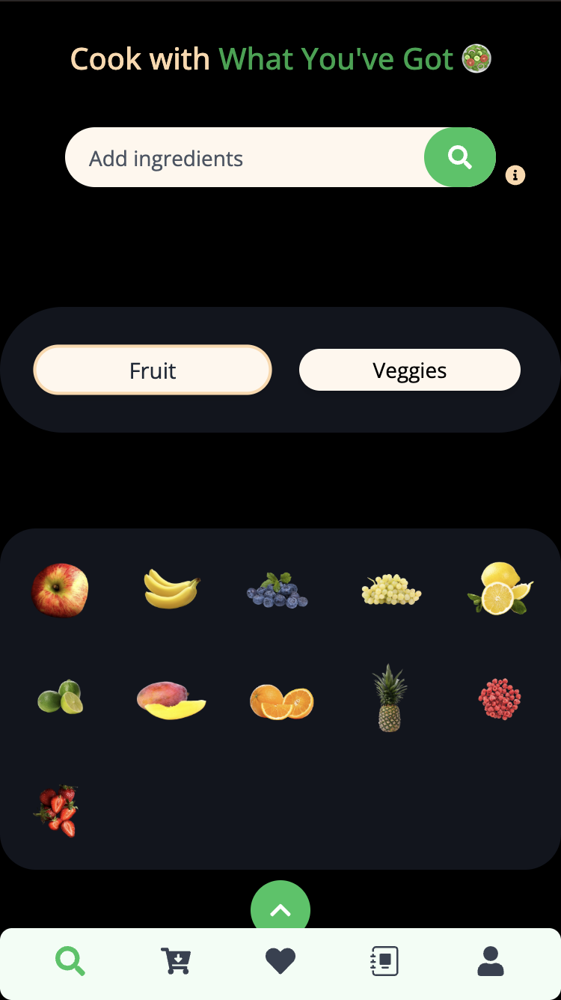
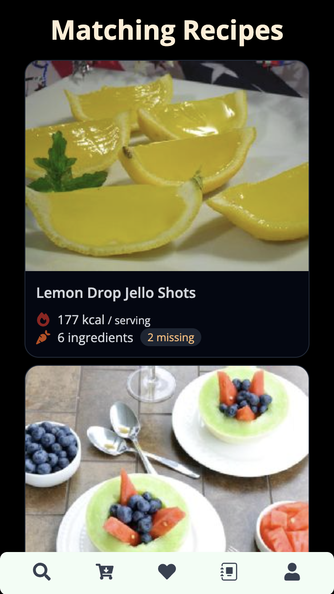
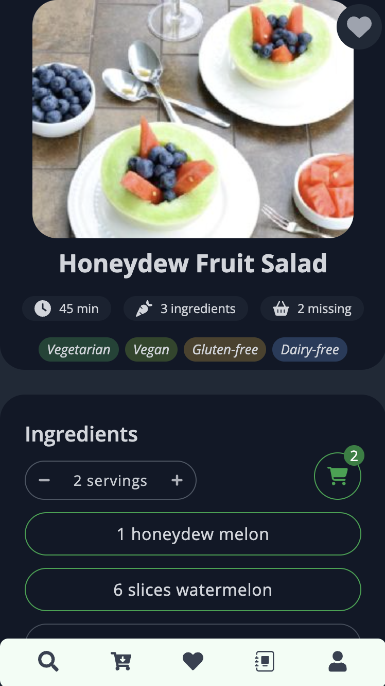
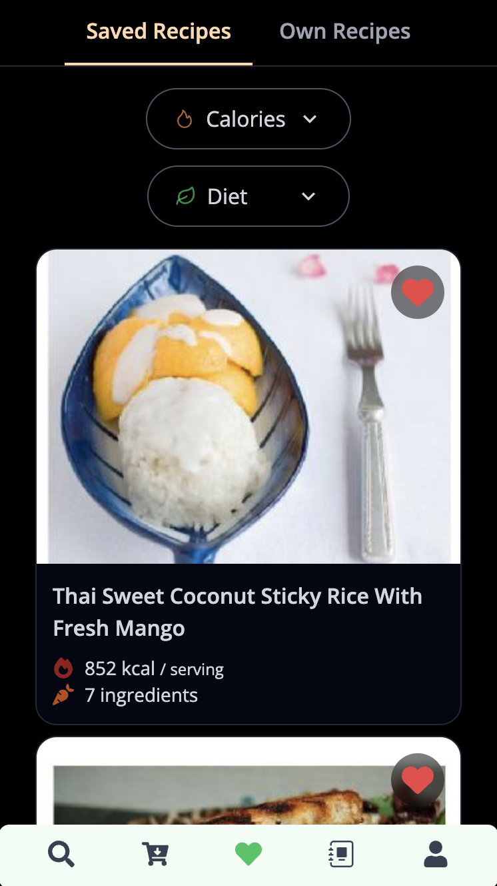
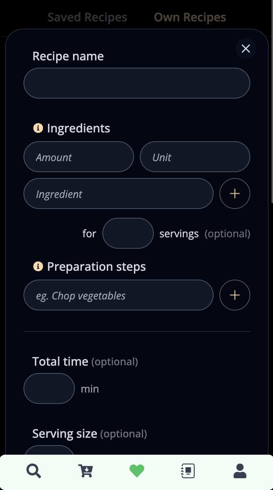
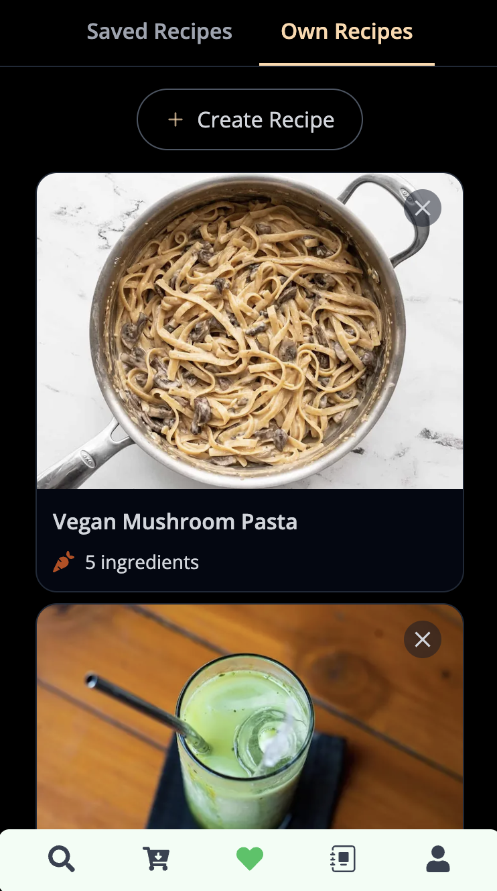
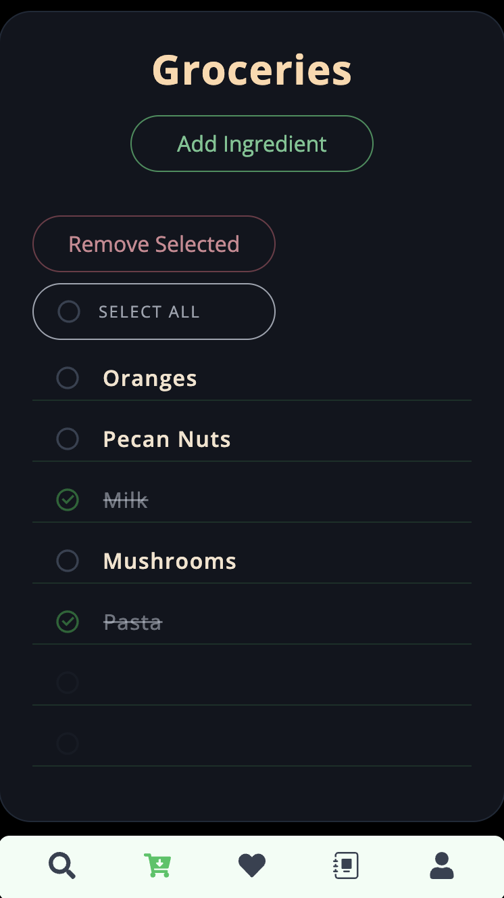
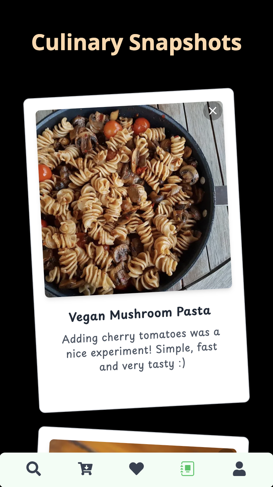

# LeckerLex

**Turn the ingredients you already have into something delicious.**

LeckerLex is a full-stack recipe app that helps you discover recipes based on ingredients you have at home, save your favorites, create your own recipes, manage a shopping list, and keep a journal of your culinary snapshots.

It includes authenticated user accounts, persistent user data, image uploads and responsive layouts designed for both desktop and mobile.

🌐 **[Live Demo](https://lecker-lex-v2.vercel.app/)**

---

## Find recipes from your ingredients

Select ingredients by clicking on the ingredient icons or simply type what you have at home. LeckerLex finds recipes that match your selection.

<!-- Mobile screenshot -->

  

---

## Explore recipes

Browse matching recipes and open one to see everything you need: ingredients, instructions and nutritional information.

  
    &nbsp;&nbsp;
  

---

## Save your favorites

Found something you want to cook later? Save recipes to your personal favorites and access them anytime.

  

---

## Create your own recipes

Add your own recipes, upload a photo and keep your personal creations together with the recipes you discover.

  
      &nbsp;&nbsp;
  

---

## Build your shopping list

Add ingredients to your shopping list, check them off while shopping and remove purchased items when you're done.

  

---

## Capture your culinary moments

Save your culinary snapshots and build a visual journal of meals you've made and enjoyed.

  

---

## ⚙️ Built with

**Frontend:** React · Vite · Tailwind CSS
**Backend:** Node.js · Express · MongoDB · Mongoose
**Authentication:** JWT · HTTP-only cookies
**Media:** Cloudinary
**Deployment:** Vercel · Northflank
